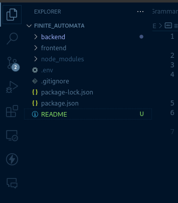

# Bridging Theory and Practice: Enhancing Student Learning in Finite Automata through Interactive Web-Based Tools

## 1.0 Introduction
This project is designed to help learners better understand the principles of finite automata by enabling them to visualize transitions and states in a more interactive and intuitive way. By bridging theory with hands-on practice, the platform allows users to engage with abstract concepts in a visual and user-friendly environment.

The project is divided into two main components: the frontend and the backend, as illustrated below:


* Frontend: Built using ReactJS, a powerful JavaScript library for creating dynamic and responsive user interfaces. The frontend delivers an interactive experience that simplifies complex topics like state transitions in finite automata.

* Backend: Developed with Node.js, a JavaScript runtime for building scalable server-side applications. The backend handles data management, automata processing, and communication with the frontend, ensuring a smooth and efficient user experience.


## Requirements
1. Install Node js from [here](https://nodejs.org/en/download/package-manager)
2. MongoDB, either locally installed or create an account [here](https://cloud.mongodb.com)

## 3.0 Running the application
### Steps
#### 1. Clone the repository
#### 2. Navigate to the cloned directory
Open the repository using command prompt (for Windows) or terminal (for Linux or Mac based systems)
```terminal
cd finite_automata
```

#### 3. Open the directory on the editor
```terminal
code .
```
#### 4. Set up environmental variables
Create a file called .env and set up your environmental variables
```javascript
MONGO_URL = [your_Mongo_url] //e.g mongodb://127.0.0.1:27017/finite_automata
SECRET_KEY='commcomm'
```
#### 5. Install Backend Packages
On the root directory, open the terminal and install the backend depndencies
```terminal
npm install
```
#### 6. Install Frontend Packages
Navigate to the frontend directory and install the required dependencies
```terminal
cd frontend
```
```terminal
npm install
```
#### 7. Run the project
Navigate back to the root directory and run the following terminal commands:
```terminal
cd ..
```
```terminal
npm run dev
```
The frontend will run on `port 5173` while the backend runs on the set default `port 3000`.

#### 8. Opening the project on the browser
Open a new tab on your browser and use the url`http://localhost:5173`. 
Create an account and login.

